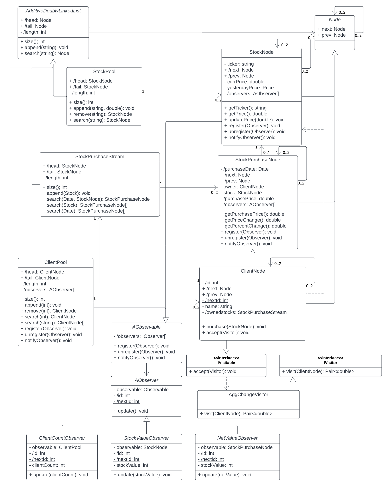

# InvestmentPortfolios

Program to simulates the management of investment portfolios for clients. This was a class project where certain design criteria was required and may not be the best solution for this problem.

## Structure
Data for clients are stored as nodes in a linked list. Each node contains access to client name, client id, several stocks, current price for each stock[^1], purchase price for each stock[^1], percent change for each stock over some time period[^1]. 

#### Visitor Class
The program uses a visitor class to compute the aggregate change in percentage and dollar value for all clients at the end of each week. 

#### Observer Class
In addition, the program uses observer classes that have interest in:

- Each time the value of the investment of a client falls by more than the minimum prescribed percentage
- Each time a new client is added or removed
- Each time the net value of the investment of a client changes by a prescribed percentage
 
#### GUI
The program includes a GUI that is updated as client information changes as described above.

## UML Class Diagram

[^1]: While these attributes  accessible by the client nodes they are stored within another data structure.